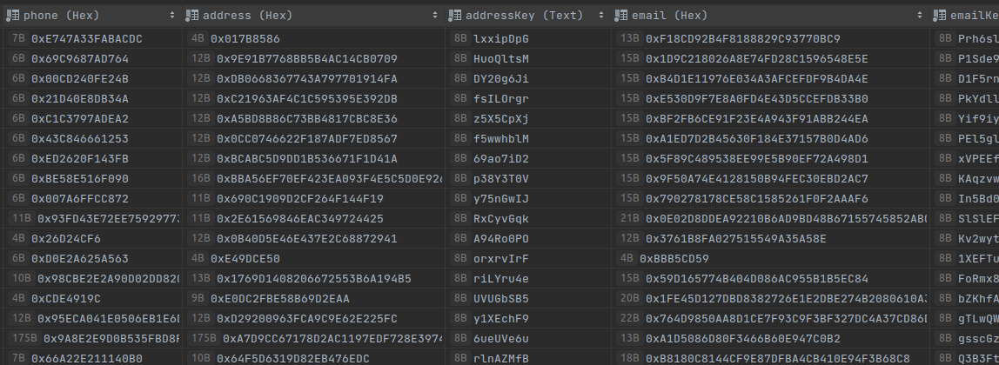
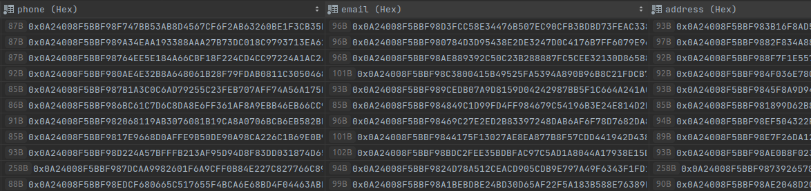

# Лаботорна робота Password storage. Hashing && Sensitive information storage

Дані лабораторні роботи мали собою на меті створення невеликого додатку для демонстрації створення надійного паролю та сховища конфіденційної інформації.

## При виконні Password storage були використані наступі практики:
* Загальна перевірка паролю використовуючи список "топ 100 найчастіших паролів"
* Жорсткі вимоги до пароля: 
    + довжина
    + використання літер різного реєстру
    + обов'язкова наявність спеціальних символів
    + обов'язкова наявність спеціальних чисел
    + виключення паролей з елементами комбінації символів на клавіатурі
    + виключення додавання ! або '1' в кінець паролю
* Використання модулю bcrypt для хешування.
* "Медові банки" на клієнтській частині застосунку.

## При виконні Sensitive information storage були використані наступі практики:
При виконанні даної частини роботи я вирішила використити два типи хешування:
* Викоритання алгоритму Salsa
    + Використовуючи алгоритм Salsa та npm пакет 'randomstring' я генерувала nonce та на основі цього хешувала дані.Вихідні дані я зберігала у базі даних. Ключ я зберігала у змінній середовища. Для генерації ключу я використовувала пункти, які були зазначені вище при створенні паролю.
    Загальна таблиця з інформацією про користувача має наступний вигляд:
    - опція, що хешуєтся
    - nonce, який був використаний при хешуванні даної опції
    
* Використання KMS сервісу від GCP
    + При викристанні даного типу хешування ми маємо більшу безпеку, адже ні створенний ключ, ні nonce ми не можемо отримати у будь якому виді, що генерує нам додаткову ступінь безпеки. Після створення ключу на платформі GCP ми можемо використовувати вбудовані методи хешувала дані. Оскільки даний сервіс сам генерує nonce, ми можемо позбутися додаткової інформації у базі даних:
    